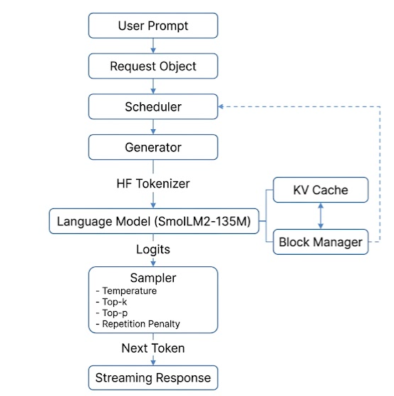
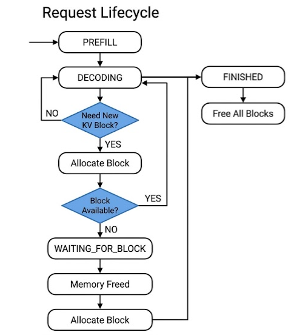
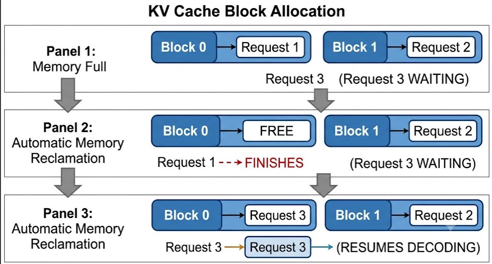

# Local LLM Inference Server

A minimal, production-style LLM inference server built from scratch to understand how modern language model serving works.

Instead of relying entirely on high-level libraries, this project implements the core inference pipeline step by step — tokenization, decoding algorithms, KV Cache, memory-aware request scheduling, and a REST API for text generation.

---

## Features

- Hugging Face model integration (SmolLM2-135M)
- Custom tokenizer wrapper
- Autoregressive text generation
- KV Cache support
- KV Cache Block Manager (fixed-size block allocation)
- Memory-aware request scheduler
- Multi-request state machine
- Temperature sampling
- Top-k sampling
- Top-p (Nucleus) sampling
- Repetition penalty
- Streaming token generation
- FastAPI REST API
- Unit tests

---

## Project Structure

```text
src/
└── inference_server/
    ├── api/
    │   ├── main.py
    │   └── schemas.py
    │
    ├── cache/
    │   └── block_manager.py
    │
    ├── generation/
    │   └── generator.py
    │
    ├── model/
    │   ├── hf_model.py
    │   └── model.py
    │
    ├── sampler/
    │   └── sampler.py
    │
    ├── scheduler/
    │   ├── scheduler.py
    │   ├── request.py
    │   └── state.py
    │
    ├── tokenizer/
    │   ├── hf_tokenizer.py
    │   └── tokenizer.py
    │
    └── utils/
```

---

## Inference Pipeline



---

## Request Lifecycle



---

## Installation

Clone the repository

```bash
git clone https://github.com/KaunAnkit/local-inference-server

cd local-inference-server
```

Install dependencies

```bash
pip install -e .
```

or

```bash
pip install -r requirements.txt
```

---

## Running the API

```bash
uvicorn --app-dir src inference_server.api.main:app --reload
```

Open

```
http://127.0.0.1:8000/docs
```

to access the Swagger UI.

---

## API

### POST /generate

Example request

```json
{
    "prompt": "Explain what an LLM is",
    "max_new_tokens": 100,
    "temperature": 0.7,
    "top_k": 50,
    "top_p": 0.9,
    "penalty": 1.2
}
```

Example response

```text
Large Language Models (LLMs) are neural networks trained on massive text datasets...
```

---

## Implemented Sampling Algorithms

### Temperature

Controls randomness during sampling.

### Top-k Sampling

Keeps only the k highest probability tokens before sampling.

### Top-p (Nucleus) Sampling

Samples from the smallest set of tokens whose cumulative probability exceeds p.

### Repetition Penalty

Reduces the probability of previously generated tokens to decrease repetition.

---

## KV Cache

The first forward pass processes the entire prompt (prefill). Subsequent generation steps process only the latest generated token while reusing cached attention states, which significantly reduces inference latency.

### KV Cache Block Manager

Instead of allocating memory continuously, the KV Cache is divided into fixed-size blocks. Each request owns a block table that tracks its allocated blocks.



When memory is exhausted:

- New requests enter a waiting state.
- Running requests continue decoding.
- Finished requests release their blocks.
- Waiting requests automatically resume once memory becomes available.

### Scheduler

The scheduler manages multiple concurrent requests through four states: `PREFILL`, `DECODING`, `WAITING_FOR_BLOCK`, and `FINISHED`.

Each scheduler iteration:

1. Processes prefill requests.
2. Decodes active requests.
3. Allocates KV cache blocks when required.
4. Suspends requests if memory is unavailable.
5. Reclaims memory from finished requests.
6. Resumes waiting requests automatically.

---

## Performance

| Version | Tokens/sec |
|---------|-----------:|
| Initial Implementation | ~2.1 |
| After KV Cache | ~8.8 |
| Streaming Generation | ~7.3 |

*(Benchmarks measured on my local machine using SmolLM2-135M.)*

---

## Running Tests

```bash
pytest
```

---

## Roadmap

### Completed

- [x] Tokenizer
- [x] Hugging Face model wrapper
- [x] Generation loop
- [x] KV Cache
- [x] Temperature sampling
- [x] Top-k sampling
- [x] Top-p sampling
- [x] Repetition penalty
- [x] Streaming generation
- [x] FastAPI REST API
- [x] Unit tests
- [x] Request scheduler
- [x] KV Cache Block Manager
- [x] Memory-aware scheduling

### Next

- [ ] Continuous batching
- [ ] Prefix caching
- [ ] Speculative decoding
- [ ] Quantization
- [ ] Flash Attention
- [ ] OpenAI-compatible API
- [ ] GPU optimization
- [ ] Benchmark suite

---

## Learning Goals

This project is built for educational purposes to better understand:

- Transformer inference
- Autoregressive decoding
- Efficient generation
- Sampling algorithms
- KV Cache
- Request scheduling
- Memory management
- Continuous batching
- Modern LLM serving systems (e.g. vLLM, TensorRT-LLM)

---

## Contributing

Contributions, suggestions, and discussions are welcome.

Feel free to open an issue or submit a pull request.

---

## License

MIT License